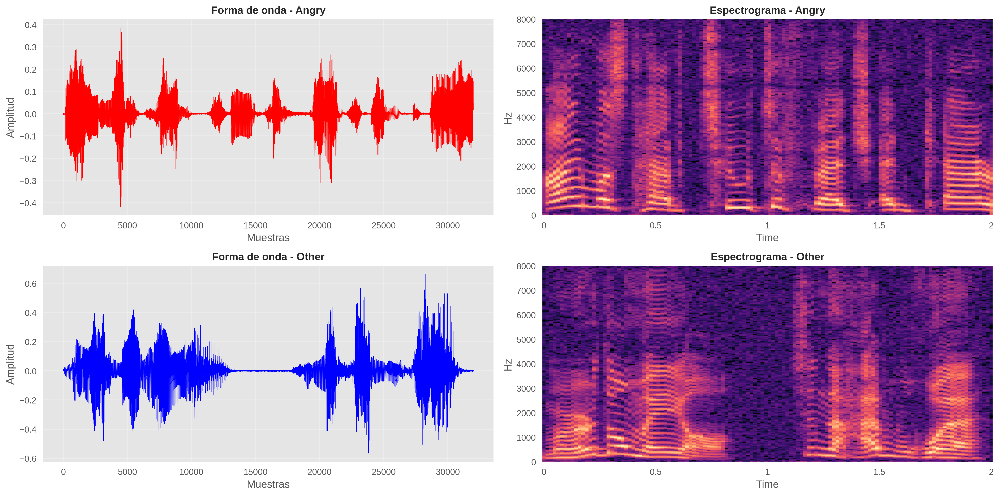

# CLUB AGS 2 - "DEL MICRÓFONO AL CEREBRO ARTIFICIAL: ¡JARVIS, ESTOY MOLESTO!"

## Descripción del Club

¿Puede una máquina saber si estás enojado solo por cómo suena tu voz? ¿Es posible que un dispositivo del tamaño de una tarjeta aprenda a reconocer emociones humanas? ¿Y cómo se entrena una IA para escuchar al mundo?

En este club exploraremos cómo la inteligencia artificial puede analizar señales de audio para identificar y clasificar emociones humanas, usando dispositivos pequeños de cómputo. A partir de grabaciones de voz, aprenderás cómo las máquinas transforman sonidos en datos, extraen patrones invisibles al oído humano y toman decisiones inteligentes.

Comenzaremos con las bases: ¿qué es el sonido y cómo se representa digitalmente?, y, ¿qué es una red neuronal artificial? Después entraremos al corazón del taller: entrenaremos modelos de aprendizaje de máquina para distinguir emociones (como el enojo) a partir del audio. Para ello utilizaremos Python, herramientas y métodos actuales de ciencia de datos, trabajando con modelos de IA usados hoy en día en investigación y desarrollo tecnológico.

Finalmente, llevaremos estos modelos al mundo físico al implementarlos en dispositivos pequeños, mostrando que la IA también puede vivir fuera de grandes servidores. Al finalizar, desarrollarás un proyecto funcional: una máquina capaz de escuchar y reconocer emociones.

## Objetivos de aprendizaje

- Identificar y describir los fundamentos del procesamiento de señales de audio y las redes neuronales artificiales, comprendiendo cómo las máquinas transforman sonido en datos y extraen patrones para reconocer emociones humanas.
- Construir e implementar modelos de aprendizaje de máquina en Python —usando herramientas modernas de ciencia de datos— capaces de clasificar emociones a partir de señales de voz, aplicando técnicas de preprocesamiento, entrenamiento y evaluación de redes neuronales.
- Diseñar y demostrar un sistema funcional de reconocimiento de emociones en audio desplegado en dispositivos de cómputo de bajo consumo, integrando hardware, software e IA para enfrentar un problema real de contexto social.

## Instructores

- Hugo Mitre ([hmitre@cimat.mx](mailto:hmitre@cimat.mx))
- Rodolfo Ferro ([ferro@cimat.mx](mailto:ferro@cimat.mx))

## Programa

### Día 1 (20/07/2026)

#### 📚 Contenidos

- **Presentación del club**
    - Presentación del curso ([slides](slides/s1_presentacion_club.pdf))
- **Introducción al cómputo afectivo** ([slides](slides/s2_computo_afectivo.pdf))
    - Emociones discretas: modelo de Ekman
    - Cómputo para el reconocimiento de emociones y sus aplicaciones reales (Oura Ring, asistentes de voz, etc.)
    - Planteamiento del problema: violencia familiar en México como caso de uso
    - Motivación del hardware: conociendo el ESP32-S3 y la visión del proyecto final
- **Fundamentos de Python y herramientas** ([slides](slides/intro-python.pdf))
    - Variables, tipos de datos y estructuras de control
    - Bibliotecas clave: NumPy, matplotlib/plotly, librosa
- **Procesamiento de señales de audio (I)** ([slides](slides/s3_audio_I%20%20-%20%20Reparado.pdf))
    - ¿Qué es el sonido y cómo se representa digitalmente?
    - Frecuencia de muestreo y teorema de Nyquist
    - Transformada de Fourier Rápida (FFT) y espectrogramas
    - Coeficientes Cepstrales en las Frecuencias de Mel (MFCC)
    - Preprocesamiento de audio:
    - Eliminación de ruido (electrónico y no humano)
    - Balanceo, muestreo y filtrado de datos

> #### 📒 Notebook: Base de señales
> 
> En este cuaderno aprenderás un sobre Python, creando un vector que representa una onda de audio y generando el sonido de la misma.
>
> 

> #### 📒 Notebook: Introducción a Python
> 
> En este cuaderno aprenderás sobre Python, cómo funciona y resolveremos algunos ejercicios prácticos relacionados al procesamiento de imágenes y canales de color. Para poder abrir tu cuadernillo de trabajo, pulsa en el botón a continuación.
>
> 

    

 

### Día 2 (21/07/2026)

#### 📚 Contenidos

- **Redes neuronales para clasificación de señales (I)** ([slides](slides/intro-dl.pdf))
    - ¿Qué es una red neuronal y cómo aprende?
    - Componentes principales: perceptrón, capas ocultas y funciones de activación
    - Entrenamiento: retropropagación y optimización
    - Implementación en Python y con TensorFlow

> #### 📒 Notebook: Introducción a las redes neuronales artificiales
> 
> En este cuaderno aprenderás sobre qué son y cómo operan las neuronas artificiales, desde un contexto histórico, hasta la aplicación de este tipo de modelos para la resolución de problemas interesantes. Para poder abrir tu cuadernillo de trabajo, pulsa en el botón a continuación.
>
> 

### Día 3 (22/07/2026)

#### 📚 Contenidos

- **Procesamiento de señales de audio (II)** ([slides](#))
    - ¿Qué es el sonido y cómo se representa digitalmente?
    - Frecuencia de muestreo y teorema de Nyquist
    - Transformada de Fourier Rápida (FFT) y espectrogramas
    - Coeficientes Cepstrales en las Frecuencias de Mel (MFCC)
    - Preprocesamiento de audio:
    - Eliminación de ruido (electrónico y no humano)
    - Balanceo, muestreo y filtrado de datos
- **Redes neuronales para clasificación de señales (II)** ([slides](slides/intro-cv.pdf))
    - Imágenes y operaciones
    - Redes neuronales convolucionales (CNN):
        - Max-feature maps, convoluciones, max-pooling, softmax
        - Arquitecturas: LeNet-5 y LightCNN-9
    - Implementación en Python y con TensorFlow

> #### 📒 Notebook: Redes neuronales artificiales
> 
> En este cuaderno pondremos en práctica el conocimiento de las redes neuronales y aprenderás a utilizar TensorFlow para programar modelos más complejos. Para poder abrir tu cuadernillo de trabajo, pulsa en el botón a continuación.
>
> 

> #### 📒 Notebook: Redes neuronales convolucionales
> 
> En este cuaderno pondremos en práctica el conocimiento de las redes neuronales convolucionales. Para poder abrir tu cuadernillo de trabajo, pulsa en el botón a continuación.
>
> 

### Día 4 (23/07/2026)

#### 📚 Contenidos

- **Proyecto final: Construyendo un Jarvis que escucha el enojo (I)** ([slides](#))
    - **Fase 1 — Datos:** preparación del dataset
    - **Fase 2 — Modelo:** entrenamiento, ajuste y evaluación del clasificador
    - **Fase 3 — Integración:** despliegue del modelo en el ESP32-S3
    - **Fase 4 — Presentación:** demostración del sistema funcional y comunicación de resultados ante el grupo

> #### 📒 Notebook: MicroLightCNN Tutorial
> 
> En este cuaderno procesaremos el audio y entrenaremos nuestro modelo estrella para utilizar en los circuitos, el modelo `MicroLightCNN`. Aquí pondremos en práctica todos los conocimientos adquiridos sobre el procesamiento de señales.
>
> 

    

 

> #### 🤖 Material: MicroESP32
> 
> 

## Referencias

Presentaciones (Hugo):
- **Presentación:** [Lecture07_UI_UX](assets/presentations/Lecture07_UI_UX.pdf)
- **Presentación:** [Lecture08_UI_UX](assets/presentations/Lecture08_UI_UX.pdf)
- **Presentación:** [Lecture09_UI_UX](assets/presentations/Lecture09_UI_UX.pdf)
- **Presentación:** [MicroLightCNN_Presentacion](assets/presentations/MicroLightCNN_Presentacion.pdf)
- **Presentación:** [s2_computo_afectivo](assets/presentations/s2_computo_afectivo.pdf)
- **Presentación:** [S3_Audio_Procesamiento_Detallado_N](assets/presentations/S3_Audio_Procesamiento_Detallado_N.pdf)
- **Presentación:** [s5_circuitos](assets/presentations/s5_circuitos.pdf)

Material para que revises:
- **[Curso de introducción a la programación científica con Python](https://futurelabmx.github.io/cdecmx/):** ¿No has programado antes? ¡No te preocupes! Este curso te dará las bases de programación con Python. El curso se divide en 3 secciones, lo básico lo encontrarás en la sección A. Python, pero será de utilidad en tu carrera como científic@ conocer las otras 2.
- **[Curso intensivo de aprendizaje automático](https://developers.google.com/machine-learning/crash-course?hl=es-419) por Google:** ¿Ya programas y quieres prepararte aún más? Te recomendamos que vayas echando un vistazo a este curso intensivo sobre Machine Learning. En este curso encontrarás ideas sobre cómo funcionan los modelos de IA en la actualidad, elementos que nos serán de utilidad durante nuestro club.
